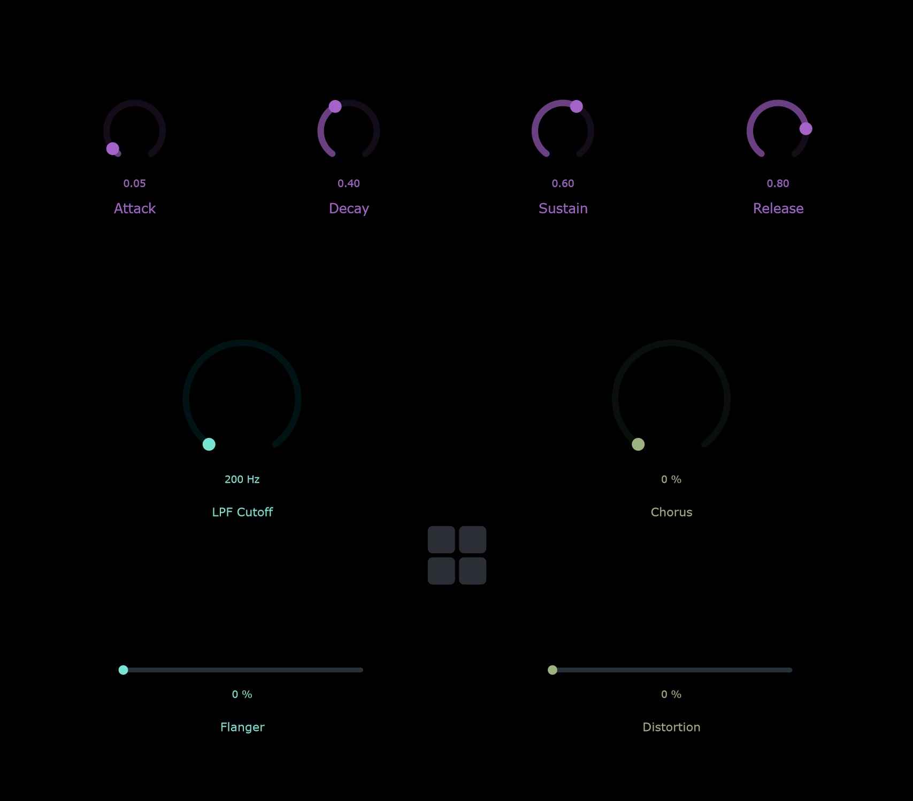
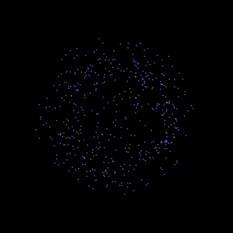

# SYNTHANDS - CMLS project (a.y. 2025/2026)
Gesture‑controlled synthesizer project developed for the _Computer Music: Languages and Systems_ course (a.y. 2025-2026).

## Purpose of the project
The SYNTHANDS project aims to design and prototype an expressive gesture‑controlled digital musical instrument that enables real‑time sound interaction without physical contact. The system explores how hand movements, captured through a standard webcam and analyzed via computer‑vision techniques, can be mapped to sound synthesis and audio effects parameters.
The core idea is to combine gesture recognition, real‑time parameter control, and digital sound synthesis into a modular and extensible system. Hand gestures are translated into continuous control data, which are then used to shape timbre, dynamics, and effects in a sound engine. This approach emphasizes expressivity, physicality, and experimentation beyond traditional controllers such as keyboards or MIDI devices.
The project integrates multiple technologies commonly used in computer music systems:

## System Overview
The system is composed of multiple modular components that communicate in real time:

- Python is used for real-time gesture analysis and data processing.
- A JUCE-based application acts as an interface and middleware layer, enabling user control and forwarding parameters between modules.
- SuperCollider is used as the main sound synthesis and audio processing engine.
- Processing is used as a graphical feedback unit, delivering an intuitive and dynamic visual representation of the interaction and sound processes.

Overall, the system is designed to support real-time responsiveness, modular development, and a clear separation between an interaction system (Python), a computer music unit (JUCE as a GUI with Supercollider as audio engine) and graphical feedback (Processing).

## Technologies Used
- Python (MediaPipe, OSC communication)
- JUCE (C++ GUI Audio Application)
- SuperCollider (real-time sound and effects synthesis)
- OSC (Open Sound Control protocol)
- Processing (real-time graphical representation for visual feedback)

## Project Outcome
This repository presents a fully functional prototype of a gesture-controlled musical instrument for real-time interaction.

- The system integrates gesture tracking, control interface, sound synthesis, and visual feedback into a coherent pipeline.
- Real-time communication between modules is stable and reliably managed through OSC.
- The JUCE interface supports both manual interaction and gesture-based 
control.

 

- The SuperCollider engine enables dynamic sound synthesis and audio processing.
- The Processing module provides continuous visual feedback linked to both gesture data and audio parameters. 

- The system can be launched reliably through a structured startup sequence, ensuring correct initialization of all components.

The project demonstrates a complete and modular interactive system, combining sensing, control, sound generation, and visualisation into a unified real-time experience.

## System Architecture and Data Flow

The system operates through real-time communication between independent modules:

- Gesture data is captured via webcam and processed in Python using MediaPipe.
- The extracted parameters (e.g. hand openness, thumb position) are sent via OSC.
- JUCE receives and optionally modifies control data through its GUI interface.
- SuperCollider receives control messages and performs sound synthesis and processing.
- Relevant audio or control parameters (from both JUCE GUI or supercollider) are sent to Processing via OSC to generate visual feedback.

This modular architecture enables flexible communication and clear separation between sensing, control, audio, and visualisation layers.

## How to Run
1. Ensure dependencies are installed and source code is built before starting the system:
   - Python environment with required libraries (see `python/environment.yml`)
   - SuperCollider
   - JUCE application built for your system
   - Processing (for real-time visualisation) built in the right folder

2. Launch the system: `start_system.bat`

The full system is launched using a system‑level batch script to ensure a
deterministic startup order and reliable MIDI handling on Windows.

Each module of the system is designed to function independently in standalone mode:
- The Python gesture‑tracking engine can be executed on its own for development and testing of computer‑vision algorithms.
- The JUCE application can run standalone as a graphical control interface, even in the absence of the Python backend.
- The SuperCollider sound engine can be launched independently for sound design, synthesis development, and MIDI testing.
- The Processing sketch can be run independently to test and develop visual feedback behaviours.

Make sure to manually run the Processing sketch to enable real-time graphical feedback during the system execution.

### Startup sequence:
1. SuperCollider is launched first to ensure exclusive MIDI access.
2. Python hand tracking component is launched.
3. The JUCE application is launched.
4. The Processing executable is started to display real-time visual feedback.

This approach guarantees both modular standalone operation and stable integrated execution, favoring robustness, reproducibility, and clear separation of system responsibilities.

## Group Members
Lorenzo Corna (Supercollider)\
Anitha Sivasankar (Supercollider) \
Tekla Gizella Kalmár (JUCE) \
Eleonora Berra (JUCE) \
Federico Giacopuzzi (Processing) \
Antonio Treviglio (Python)
